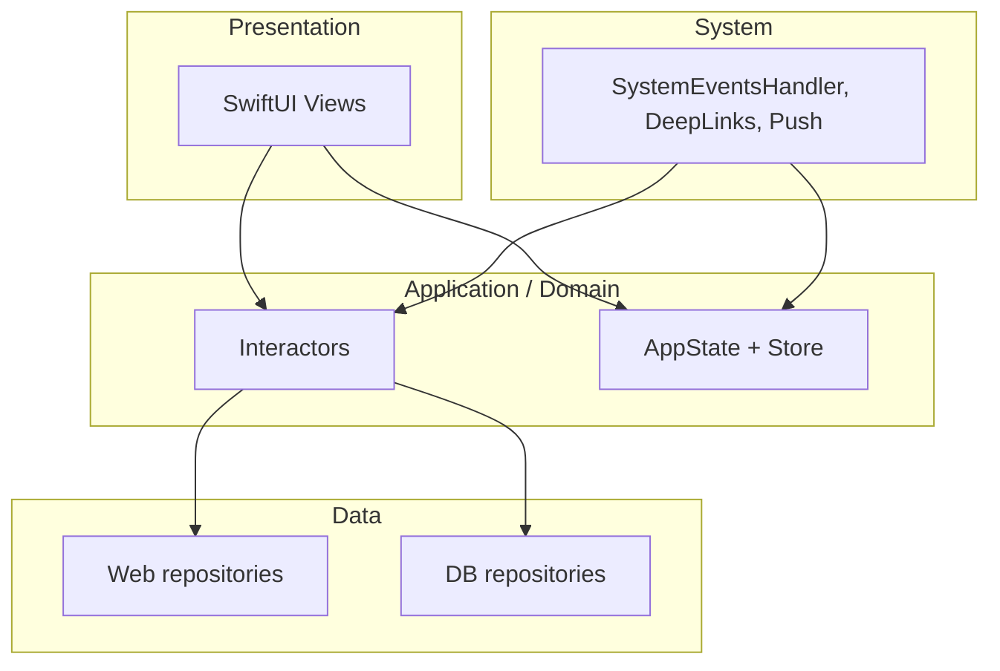

# Architecture — App (SwiftUI Clean Architecture template)

This document describes how the **App** target is structured: runtime entry, dependency injection, layers, data flow, navigation, and testing. It reflects the code under `App/` and `UnitTests/`.

## Purpose

A reusable iOS codebase you can clone for any new SwiftUI app. It demonstrates a small, explicit **clean-style** layering — UI → interactors → repositories, with a single composition root — plus the supporting infrastructure for image loading, push notifications, deep links, and scene lifecycle wiring.

## Technology stack

| Area | Choice |
|------|--------|
| UI | SwiftUI (`NavigationStack`, `.searchable`, `.refreshable`, sheets) |
| Persistence | SwiftData (`@Model`, `ModelContainer`, `@Query` via helpers) |
| Reactive state | Combine (`Store` = `CurrentValueSubject`, publishers for routing/permissions) |
| Networking | `URLSession` with a shared, configured session |
| Package manager | Swift Package Manager (`Package.swift`) |
| Platforms | iOS 18+ (package definition); UIKit bridge for `AppDelegate` / scenes |
| Dev / QA | [EnvironmentOverrides](https://github.com/nalexn/EnvironmentOverrides) (locale/size previews), [ViewInspector](https://github.com/nalexn/ViewInspector) for UI tests |

The Xcode target `App.xcodeproj` wraps the same sources; the **library** and **UnitTests** target are defined in `Package.swift`.

---

## High-level structure

Dependencies point **inward**: views depend on interactors and global app state through DI; interactors depend on repository protocols; repositories depend on Foundation / SwiftData / UIKit as needed.

---

## Runtime entry and composition

1. **`MainApp`** (`Core/App.swift`) — SwiftUI `@main` app; attaches `AppDelegate` and shows `appDelegate.rootView`.
2. **`AppDelegate`** (`Core/AppDelegate.swift`) — `@MainActor`; lazily builds **`AppEnvironment.bootstrap()`**, forwards push registration and remote notification hooks to **`SystemEventsHandler`**, and registers **`SceneDelegate`** with the same handler for URL and scene callbacks.
3. **`AppEnvironment`** (`DependencyInjection/AppEnvironment.swift`) — **Composition root** (`bootstrap()`): creates `URLSession` → **web repositories** → **`ModelContainer`** → **DB repositories** (`MainDBRepository`) → **interactors** → **`DIContainer`** → **`DeepLinksHandler`** / **`PushNotificationsHandler`** / **`RealSystemEventsHandler`**.

The root SwiftUI tree (`AppEnvironment.rootView`) injects:

- `.modelContainer(modelContainer)` for SwiftData
- `.inject(diContainer)` — custom `EnvironmentValues.injected` (`DIContainer`)
- `RootViewAppearance` — blur when app is inactive (`AppState.system.isActive`)
- **EnvironmentOverrides** — resets routing when locale or size category changes

When `ProcessInfo.isRunningTests` is true (see `Utilities/Helpers.swift`), the root view shows a placeholder instead of the real UI.

---

## Dependency injection

### `DIContainer`

Defined in `DependencyInjection/DIContainer.swift`:

- **`appState`**: `Store<AppState>` — global equatable app state (routing, system, permissions).
- **`interactors`**: grouped `ImagesInteractor`, `UserPermissionsInteractor` (add new ones here).

Nested types describe construction groups: **`WebRepositories`**, **`DBRepositories`**, **`Interactors`**.

### Environment injection

- `EnvironmentValues.injected` defaults to a **stub** container for previews and safety.
- Production uses `.inject(diContainer)` from `AppEnvironment.rootView`.

Views read services with `@Environment(\.injected) private var injected: DIContainer`.

---

## Layer reference

### 1. UI (`UI/`)

- **`HomeView`** — template root screen demonstrating the pattern: reads `DIContainer` through `@Environment(\.injected)`, mirrors a screen-local `Routing` struct into `AppState.routing.home` via `Binding.dispatched(to:_:)`, exposes an inspection hook for tests.
- **`RootViewAppearance`** — subscribes to `AppState.system.isActive` for background blur.
- **Common** — `ImageView`, `ErrorView`, search/query helpers.

**Rule of thumb:** views call **interactor** methods and observe **`AppState`** via Combine; they do not configure `URLSession` or call web endpoints directly.

### 2. Interactors (`Interactors/`)

Use-case orchestration with **`protocol` + `Real*` + `Stub*`**:

| Protocol | Role |
|----------|------|
| `ImagesInteractor` | Load `UIImage` from URLs via web repository into `LoadableSubject<UIImage>` |
| `UserPermissionsInteractor` | Resolve / request push permission; updates `AppState.permissions` |

Add feature-specific interactors (e.g. `MyFeatureInteractor`) here and wire them into `AppEnvironment.configuredInteractors`.

### 3. Repositories

**Web** (`Repositories/WebAPI/`):

- Shared **`WebRepository`** helper: builds `URLRequest` from **`APICall`**, uses `session.data(for:)`, validates HTTP codes, decodes JSON, maps errors to **`APIError`**.
- **`RealImagesWebRepository`** — `download` + `UIImage` deserialization.
- **`PushTokenWebRepository`** — stub endpoint for forwarding the device push token to your backend.

**Database** (`Repositories/Database/`):

- **`ModelContainer` extensions** — `appModelContainer()` builds schema from `Schema.appSchema`; **`stub`** in-memory container used when creation fails (UI shows a warning).
- **`MainDBRepository`** — `@ModelActor` actor; conform it to feature-specific protocols in an `extension MainDBRepository: MyFeatureDBRepository { ... }` file using **`modelContext.transaction`** for writes.

**Models** (`Repositories/Models/`):

- **`DBModel`** — namespace for SwiftData `@Model` types you add.
- **`ApiModel`** — namespace for `Codable` DTOs.
- **`AppSchema.swift`** — single **`Schema`** version for migrations; register new `DBModel.*` types here.

### 4. Core (`Core/`)

- **`AppState`** — nested **`ViewRouting`** (per-screen routing structs), **`System`** (active flag, keyboard height), **`Permissions`** (push status). Custom **`==`** only compares selected fields (routing + system + permissions equality strategy).
- **`DeepLinksHandler`** — parses URLs / notification payloads into **`DeepLink`** cases; updates **`AppState.routing`** (with a delayed two-step reset workaround for SwiftUI navigation). Template ships with a single `.home` case — add yours.
- **`PushNotificationsHandler`** — `UNUserNotificationCenterDelegate`; forwards taps to deep links via an `aps.deepLink` payload (replace with your APNs schema).
- **`SystemEventsHandler`** — keyboard height → `AppState`, scene active/inactive, URL open, push-related hooks; subscribes once to push permission changes to re-request the token when appropriate.

---

## UI state patterns

### `Store<AppState>`

`Utilities/Store.swift` typealiases `Store<State>` to **`CurrentValueSubject<State, Never>`** with helpers: subscript setters for key paths, **`bulkUpdate`**, and **`updates(for:)`** for Combine subscriptions.

### `Loadable<T>`

`Utilities/Loadable.swift` — async operation state machine: `notRequested` → `isLoading` (with **`CancelBag`**) → `loaded` / `failed`. **`LoadableSubject.load`** starts a `Task` and ties cancellation to **`CancelBag`**.

### Routing

Screen-local **`Routing`** structs are mirrored into **`AppState.ViewRouting`** using **`Binding.dispatched(to:_:)`** (pattern used by `HomeView`) so **deep links** and **views** share one source of truth for navigation and sheets.

---

## Cross-cutting concerns

- **Localization** — `Localizable.xcstrings`, `Locale.backendDefault`, string helpers in `Helpers.swift`.
- **Errors** — `ErrorView` + retry actions at view level; typed **`APIError`** at network boundary.
- **Testing** — `UnitTests/` mirrors layers: mocked repositories and interactors, `RequestMocking`, ViewInspector `Inspection` hooks on key views.

---

## Directory map (production)

| Path | Responsibility |
|------|------------------|
| `Core/` | App entry, delegates, app state, deep link & push & system bridge |
| `DependencyInjection/` | `DIContainer`, `AppEnvironment` bootstrap |
| `Interactors/` | Use cases |
| `Repositories/WebAPI/` | HTTP + decoding |
| `Repositories/Database/` | SwiftData container + `@ModelActor` repository |
| `Repositories/Models/` | API DTOs, DB models, schema |
| `UI/` | SwiftUI screens and components |
| `Utilities/` | `Store`, `Loadable`, `CancelBag`, helpers |

---

## Extension points

When adding a feature:

1. Add or extend **repository protocols** and real implementations.
2. Add **interactor** API (`protocol` + `Real*` + `Stub*`) and wire it in **`AppEnvironment.configuredInteractors`**.
3. Expose on **`DIContainer.Interactors`** if needed from UI.
4. Extend **`AppState`** routing or permissions if global coordination is required.
5. Add **unit tests** with existing mock/stub patterns under `UnitTests/`.

---

## Related project files

- **Build and run** — [BUILD.md](BUILD.md) (Xcode, simulator, `xcodebuild`, tests).
- **Cursor rules** — `.cursor/rules/architecture.mdc` (layer boundaries aligned with this document).
- **GitNexus** — `CLAUDE.md` / `AGENTS.md` may contain generated indexing hints; local graph output lives under `.gitnexus/` (gitignored).
